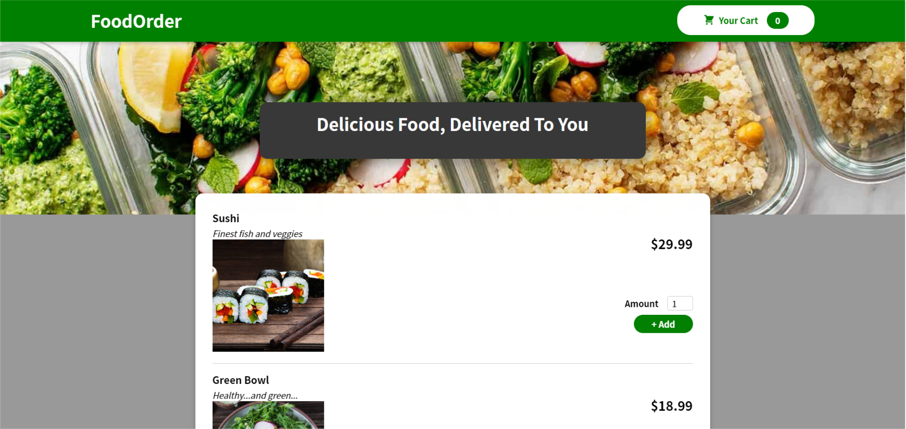
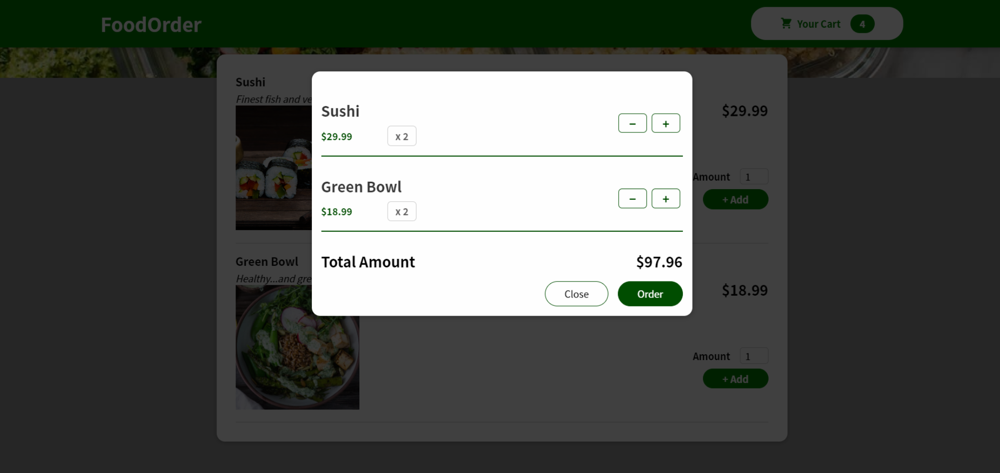
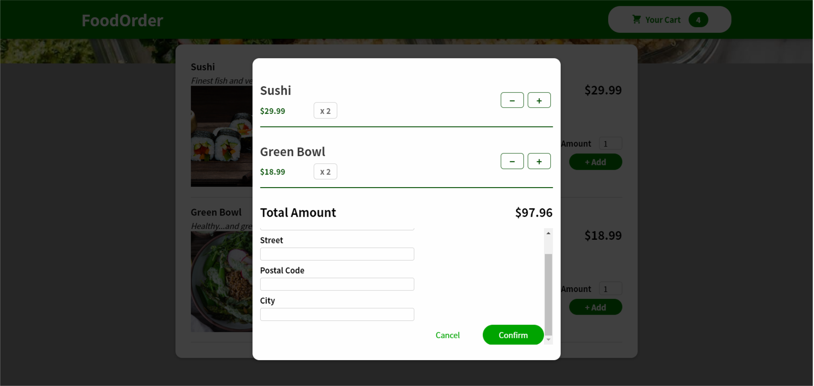

# Food Order App

---

This app is for food order and delivery.

App was built with React JS.

### Description

A simple food order app, where client can get a list of meals, choose the desired ones and add them to the cart. The client can change the amounts and add them multiple times with the possibility to see what is in the cart.
The cart can be changed from the page and ultimately click order button to open checkout form for the client to fill in their name and address.

By confirming the order, the entered data are sent to a backend.
Firebase used as a backend.

### Project ScreenShots

### Installation and Setup Instructions

Clone down this repository. You will need node and npm installed globally on your machine.

Installation:

`npm install`

To Start Server:

`npm start`

To Visit App:

`localhost:3000`
